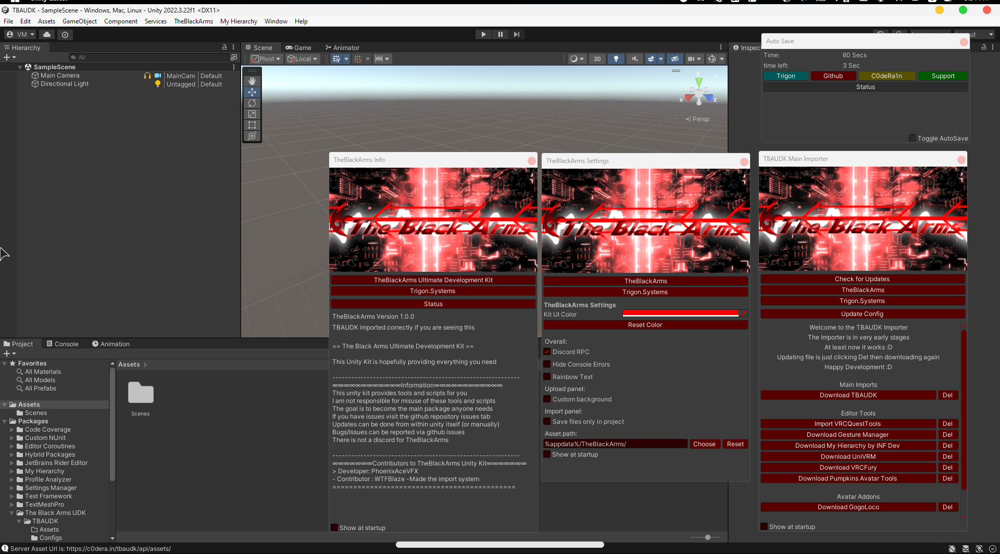

  

  
  
# The Black Arms UDK  
A properly independent VRC Development toolset  
Currently in development :D  
Note this is based on Zenith's ZPUK  
As of this moment the Asset Portal is ONLINE  
  

